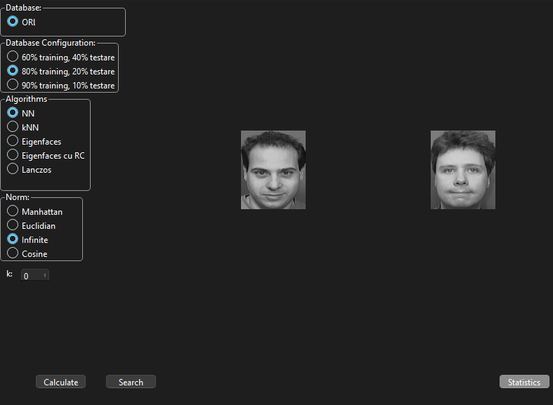
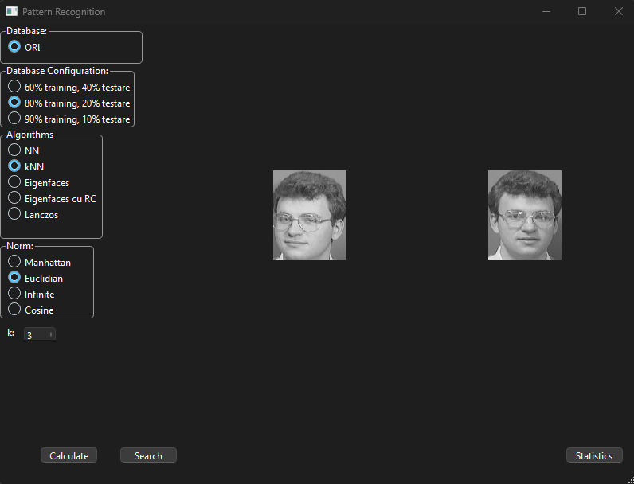
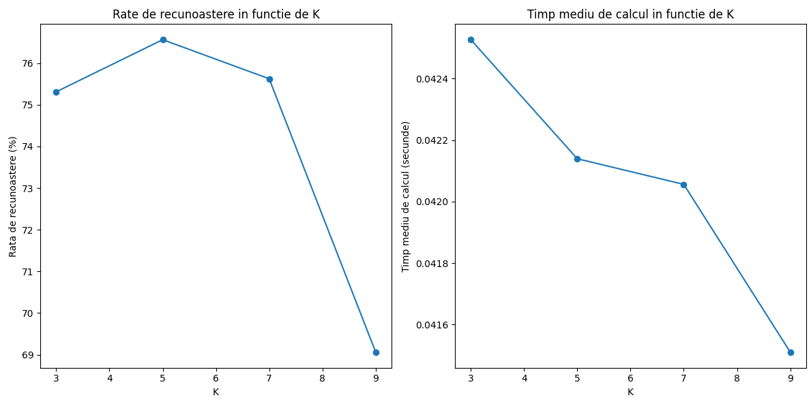
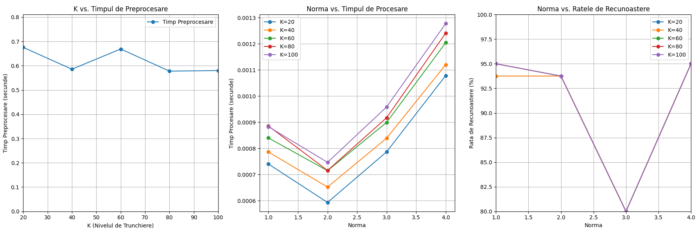
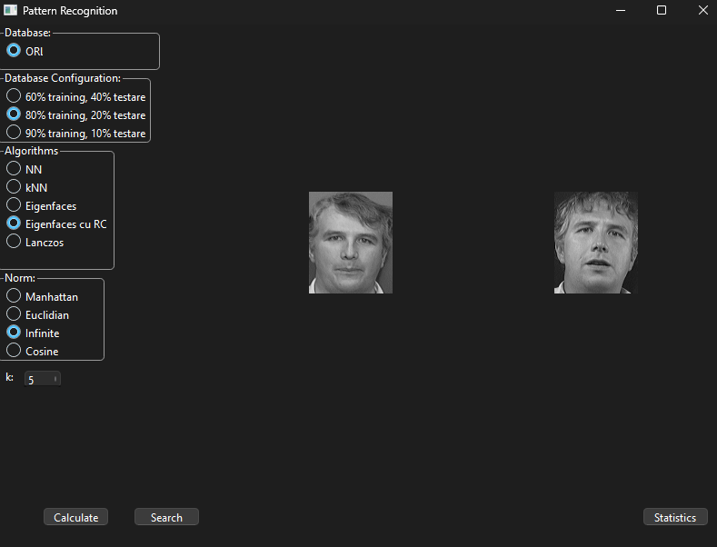
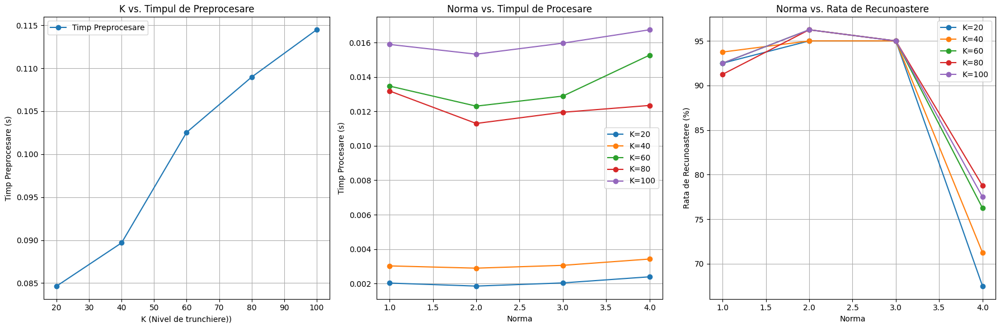
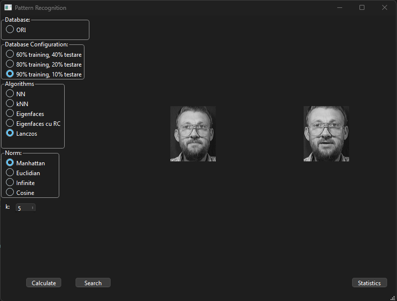
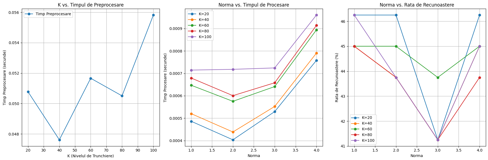

# 🔍 Face Recognition System

A comprehensive face recognition system built with Python and PyQt6, implementing multiple algorithms for facial identification and analysis.

## 📋 Table of Contents
- [Overview](#overview)
- [Features](#features)
- [Installation](#installation)
- [Dataset](#dataset)
- [Methods](#methods)
  - [Nearest Neighbor (NN)](#nearest-neighbor-nn)
  - [K-Nearest Neighbors (k-NN)](#k-nearest-neighbors-k-nn)
  - [Eigenfaces](#eigenfaces)
  - [Eigenfaces with Class Representatives](#eigenfaces-with-class-representatives)
  - [Lanczos Algorithm](#lanczos-algorithm)
- [Results & Statistics](#results--statistics)
- [Usage](#usage)
- [Technical Details](#technical-details)

## 🎯 Overview

This project implements a face recognition system with a graphical user interface that allows users to test different recognition algorithms on the AT&T Face Database. The system provides comprehensive statistics and performance analysis for each method.

### Key Capabilities:
- **Multiple Recognition Algorithms**: NN, k-NN, Eigenfaces, Class Representatives, Lanczos
- **Various Distance Metrics**: Manhattan, Euclidean, Infinite norm, Cosine similarity
- **Performance Analysis**: Recognition rates, processing times, statistical comparisons
- **Visual Interface**: PyQt6-based GUI for easy interaction

## ✨ Features

- 🖼️ **Interactive GUI** - Select images and view results in real-time
- 📊 **Statistical Analysis** - Comprehensive performance metrics
- 🔄 **Multiple Algorithms** - Compare different face recognition methods
- 📈 **Visualization** - Matplotlib graphs for performance analysis
- ⚡ **Configurable Training** - Adjustable training set sizes (6, 8, or 9 images per person)

## 🛠️ Installation

### Prerequisites
```bash
pip install PyQt6 opencv-python numpy matplotlib scipy
```

### Clone the Repository
```bash
git clone https://github.com/davidfilimon/Face-Recognition.git
cd Face-Recognition
```

### Run the Application
```bash
python app.py
```

## 📁 Dataset

The system uses the **AT&T Face Database** (formerly ORL Database):
- **40 individuals** with **10 images each**
- **Resolution**: 112x92 pixels
- **Format**: PGM (Portable Gray Map)
- **Total Images**: 400

Expected directory structure:
```
att_faces/
├── s1/
│   ├── 1.pgm
│   ├── 2.pgm
│   └── ...
├── s2/
│   └── ...
└── s40/
    └── ...
```

## 🧠 Methods

### Nearest Neighbor (NN)

The simplest approach that finds the closest match in the training set.

**Algorithm:**
1. Calculate distance between test image and all training images
2. Return the class of the nearest neighbor

**Screenshots:**

*NN method interface showing selected image and recognized result*

**Performance Metrics:**

*Recognition rates and processing times for different norms*

---

### K-Nearest Neighbors (k-NN)

Extends NN by considering k closest neighbors and using majority voting.

**Algorithm:**
1. Find k nearest neighbors
2. Use majority voting to determine the class
3. Handle ties appropriately

**Screenshots:**

*k-NN method with configurable k parameter*

**Performance Analysis:**

*Performance comparison across different k values and norms*

---

### Eigenfaces

Principal Component Analysis (PCA) based approach using eigenface decomposition.

**Algorithm:**
1. Compute mean face from training set
2. Calculate covariance matrix and eigenfaces
3. Project images into eigenspace
4. Classify using nearest neighbor in reduced space

**Screenshots:**

*Eigenfaces method showing dimensionality reduction*

**Performance Results:**

*Recognition rates vs. truncation level and processing norms*

---

### Eigenfaces with Class Representatives

Enhanced eigenface method that computes separate eigenspaces for each class.

**Algorithm:**
1. Compute class-specific mean faces and eigenfaces
2. Project test images into each class eigenspace
3. Find minimum distance to any class representative
4. Classify based on closest class

**Screenshots:**

*Class representatives method interface*

**Performance Comparison:**

*Comparison of recognition rates and computational efficiency*

---

### Lanczos Algorithm

Iterative method for computing eigenfaces using Lanczos decomposition.

**Algorithm:**
1. Use Lanczos iteration to find dominant eigenvalues/eigenvectors
2. Construct eigenface basis more efficiently
3. Project and classify similar to standard eigenfaces

**Screenshots:**

*Lanczos algorithm implementation*

**Computational Efficiency:**

*Lanczos vs. standard eigenface computation times*

## 📊 Results & Statistics

### For the statistics check the graphs above.

## 🚀 Usage

### Basic Usage

1. **Launch the application**
   ```bash
   python main.py
   ```

2. **Select training set size**
   - Choose between 6, 8, or 9 training images per person

3. **Choose recognition method**
   - Select from NN, k-NN, Eigenfaces, Class Representatives, or Lanczos

4. **Configure parameters**
   - Set distance norm (Manhattan, Euclidean, Infinite, Cosine)
   - For k-NN and eigenface methods, specify the k parameter

5. **Select test image**
   - Click "Search" to browse for a test image
   - The selected image will be displayed

6. **Run recognition**
   - Click "Calculate" to perform recognition
   - View the recognized result

7. **View statistics**
   - Click "Statistics" to see comprehensive performance analysis

### Advanced Features

- **Batch Processing**: Run statistics on entire test set
- **Performance Visualization**: Generate matplotlib graphs
- **Export Results**: Save statistics to text files

## 🔧 Technical Details

### System Requirements
- **Python**: 3.7+
- **Memory**: 4GB+ RAM recommended
- **Storage**: 100MB for dataset

### Dependencies
```python
PyQt6==6.4.0
opencv-python==4.7.1
numpy==1.24.3
matplotlib==3.7.1
scipy==1.10.1
```

### Architecture
```
MainApp (QMainWindow)
├── UI Components (PyQt6)
├── Image Processing (OpenCV)
├── Linear Algebra (NumPy)
├── Statistical Analysis (SciPy)
└── Visualization (Matplotlib)
```

### Performance Optimizations
- **Vectorized Operations**: NumPy for efficient matrix computations
- **Memory Management**: Optimized data structures
- **Preprocessing Cache**: Reuse computed eigenfaces when possible
